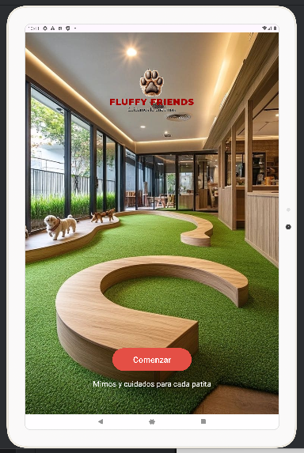
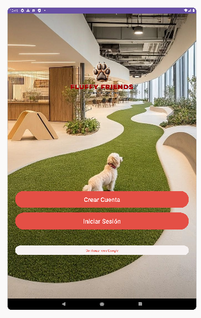
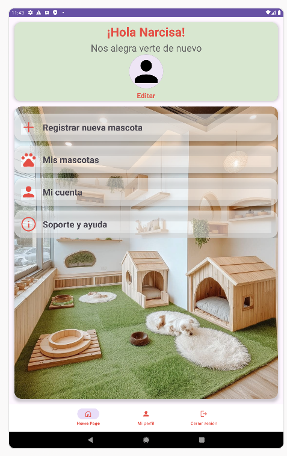
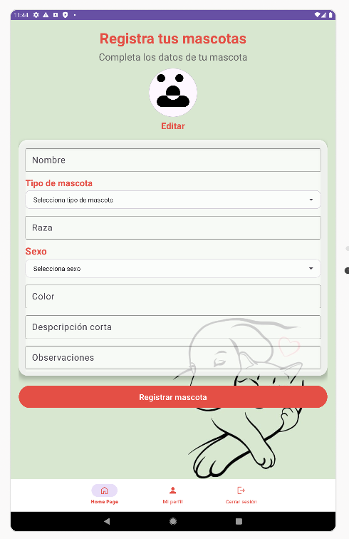
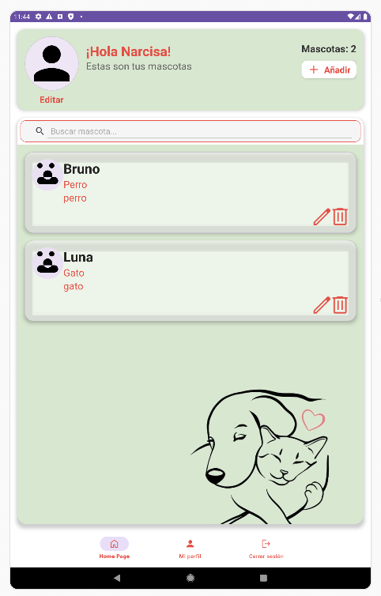
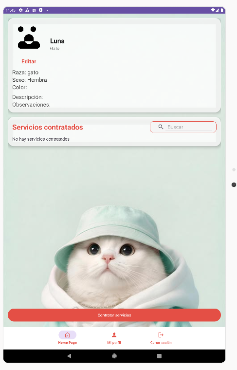
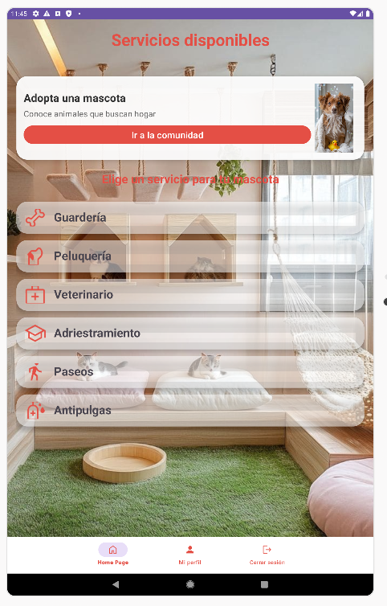
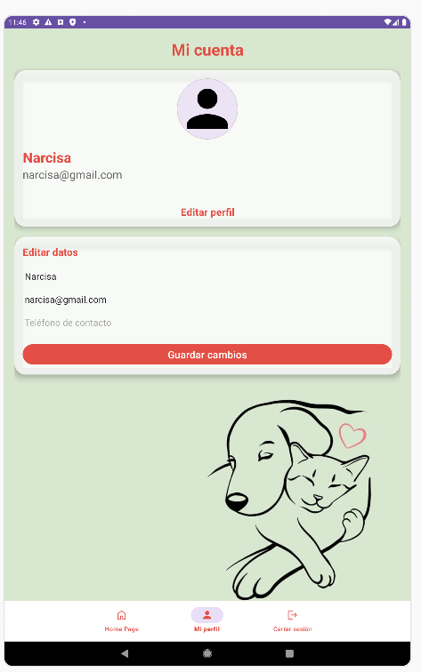

# 🐾 FluffyFriends

FluffyFriends permite a los usuarios gestionar sus mascotas de forma sencilla, almacenando información personalizada, fotografías y el historial de servicios asociados a cada mascota.

---

# 📱 Descripción

La aplicación está orientada a propietarios de mascotas que desean tener toda la información de sus animales organizada en un único lugar.

Cada usuario puede:

- Crear una cuenta.
- Gestionar su perfil personal.
- Registrar mascotas.
- Consultar información detallada de cada mascota.
- Editar datos de mascotas existentes.
- Registrar servicios realizados.
- Consultar el historial de servicios.

---

## 📱 Plataforma objetivo

La aplicación fue desarrollada y optimizada principalmente para dispositivos Android tipo tablet, siguiendo los requisitos académicos del proyecto.

---

# 🎯 Objetivos del proyecto

El objetivo principal del proyecto fue poner en práctica los conocimientos adquiridos durante el ciclo DAM mediante el desarrollo de una aplicación Android completa utilizando:

- Java
- Android Studio
- SQLite
- Material Design
- RecyclerView
- Navigation Components
- Gestión de imágenes
- Arquitectura basada en Activities

---

# 📸 Capturas de pantalla

## Comenzar

---

## Inicio de sesión

---

## Pantalla principal

---

## Registro de mascotas

---

## Mis mascotas

---

## Perfil de mascota

---

## Servicios

---

## Perfil de usuario

---

# ⚙️ Funcionalidades principales

### Gestión de usuarios

- Registro de usuarios.
- Inicio de sesión.
- Edición de perfil.
- Fotografía de perfil personalizada.

### Gestión de mascotas

- Alta de mascotas.
- Modificación de datos.
- Eliminación de mascotas.
- Visualización detallada.

### Gestión de servicios

- Registro de servicios asociados a mascotas.
- Historial de servicios.
- Consulta individual de cada servicio.

### Búsquedas

- Filtrado de mascotas.
- Filtrado de servicios.

---

# 🗄️ Base de datos

La aplicación utiliza SQLite para el almacenamiento local de la información.

Principales entidades:

### Usuario

- id
- nombre
- email
- teléfono
- contraseña
- fotoPath

### Mascota

- id
- nombre
- raza
- sexo
- tipo
- color
- descripción
- observaciones
- fotoPath

### ServicioMascota

- id
- tipo
- descripción
- fecha
- idMascota

---

# 🛠️ Tecnologías utilizadas

- Java
- Android Studio Jellyfish
- SQLite
- Material Design
- RecyclerView
- CardView
- ConstraintLayout
- BottomNavigationView

---

# 🚧 Dificultades encontradas

Durante el desarrollo surgieron diversos retos técnicos:

- Gestión de imágenes en Android.
- Persistencia de imágenes seleccionadas por el usuario.
- Relaciones entre mascotas y servicios.
- Navegación entre Activities.
- Sincronización de datos almacenados en SQLite.
- Adaptación de interfaces mediante Material Design.

Estos problemas permitieron profundizar en el funcionamiento interno de Android y mejorar la organización general del proyecto.

---

# 📈 Posibles mejoras futuras

- Notificaciones de recordatorios.
- Calendario de vacunas.
- Historial médico completo.
- Almacenamiento en la nube.
- Sistema de citas veterinarias.
- Múltiples perfiles de usuario.
- Modo oscuro.

---

# 👨‍💻 Autor

Proyecto final del ciclo:

**Desarrollo de Aplicaciones Multiplataforma (DAM)**

---

# 📄 Licencia

Proyecto desarrollado con fines educativos y académicos.
